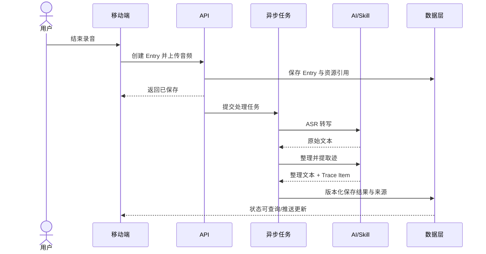
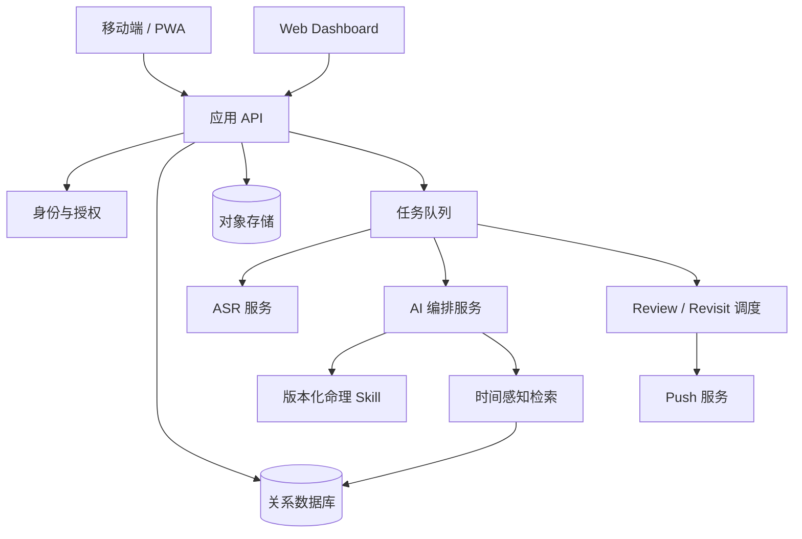
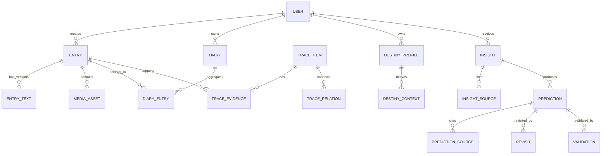

# Meridian 第一阶段产品需求文档（MVP）

> 版本：v1.0  
> 日期：2026-09-06  
> 状态：Draft  
> 产品载体：移动端优先，Web 端补充回顾与浏览  
> 上位文档：[MERIDIAN_CONTEXT.md](./MERIDIAN_CONTEXT.md)

## 1. 产品定义

Meridian 是一个围绕人生如何随时间展开的长期个人产品。

第一阶段以“命 + 迹”为核心：用户通过语音或文字留下真实生活；系统将记录整理为可阅读的日记，并提取可长期积累的现实轨迹；命理系统提供稳定的基础先验和随时间变化的周期上下文；AI 将两者结合，生成阶段解读并保存可在未来验证的判断。

MVP 核心闭环：

**记录生活 → 形成迹 → 结合命 → 阶段解读 → 保存 Prediction → 现实继续发生 → 回看与验证**

第一阶段不分别建设完整的 Record、Understand、Trace、Destiny、Future、Revisit 六个模块，而是让六类体验从同一套数据和分析闭环中生长。

## 2. 目标与非目标

### 2.1 产品目标

1. 用户能在手机端快速完成一次语音或文字记录。
2. 系统同时保留原始内容与 AI 整理结果，不破坏来源真实性。
3. 系统能从记录中持续提取结构化的“迹”。
4. 系统能基于同一条 Pipeline 生成主动 Insight、周 Review 和月 Review。
5. 命理结果稳定、可复用，并包含随日期变化的阶段上下文。
6. 重要的未来判断能作为 Prediction 独立保存，并在到期后由现实验证。
7. 用户能按日、周、月回看真实记录、结构化轨迹和已有解读。

### 2.2 非目标

MVP 不包含：

- 完整 Life Map 或关系图谱界面；
- 独立的“命 / 迹 / 心”三栏产品结构；
- 完整 Future Branch 管理；
- 图片、视频、耳机、锁屏、小组件等扩展入口；
- 用户手动维护复杂标签和个人数据库；
- 每日强制生成完整 AI 报告；
- 多套命理体系自由切换；
- 以聊天为主界面的通用 AI 助手；
- 情绪分数、人生指数等 KPI 式 Dashboard。

## 3. 核心概念

| 概念 | 定义 |
|---|---|
| Entry | 一次独立的语音或文字输入，是不可丢失的原始记录单元 |
| Diary | 同一用户同一自然日内 Entry 的聚合阅读视图，不替代 Entry |
| Trace Item（迹） | 从 Entry 中提取出的现实实体、状态、行为或关系 |
| Destiny Profile（命） | 基于出生信息生成并版本化保存的稳定命理基础结果 |
| Destiny Context | 基于 Destiny Profile 和指定日期生成的流年、流月等阶段上下文 |
| Insight | 针对某一时间范围，由“命 + 迹”生成的一次阶段解读 |
| Prediction | 从命理或综合解读中形成的、具有明确时间窗口且可验证的判断 |
| Revisit | Prediction 到达验证窗口后，将历史判断与期间真实轨迹重新对照 |

“心”暂不作为独立产品对象。Emotion、State、Value、Thought 作为 Trace Item 保存，并参与分析。

## 4. 目标用户与核心场景

### 4.1 目标用户

- 愿意记录生活，但难以坚持传统日记的人；
- 希望理解近期状态、长期变化和人生选择的人；
- 对命理有兴趣，但不满足于一次性报告的人。

### 4.2 核心场景

1. **即时记录**：用户打开 Meridian，直接说话，结束后退出。
2. **当天回看**：用户查看今天整理后的日记及少量人物、事件、情绪和目标。
3. **主动解读**：用户请求“看看今天 / 最近 7 天 / 这个月”。
4. **周期 Review**：系统每周、每月自动生成阶段解读并选择值得推送的内容。
5. **预测回看**：Prediction 到期后，系统用期间真实记录生成 Revisit，用户确认匹配程度。

## 5. 产品原则

1. **移动记录优先**：首页首要动作是开始记录。
2. **原始数据不可覆盖**：转写、整理和推断均保留版本与来源。
3. **用户低摩擦，系统内结构化**：默认由 AI 提取，用户只做必要确认。
4. **日记与解读分离**：每天都有 Diary，但不要求每天都有 Insight。
5. **命理是先验，不是结论**：表达可能性和对应关系，不替用户做决定。
6. **重要判断必须可追溯**：Insight 和 Prediction 引用具体 Entry 或 Trace Item。
7. **同一分析 Pipeline**：主动与被动触发只改变触发方式和时间范围。
8. **重新出现必须有理由**：推送提供相关性，不只因为日期到了。

## 6. MVP 功能范围

### 6.1 首次使用与基础资料

#### 必须支持

- 手机号、邮箱或第三方账号登录；
- 设置时区；
- 录入姓名或称呼、出生日期、出生时间、出生地点；
- 明示命理分析所需信息、用途及隐私授权；
- 出生时间未知时允许继续，并标记结果不确定性；
- 生成并保存一份版本化的 Destiny Profile。

#### 验收标准

- 同一输入和同一 Skill 版本重复计算得到一致的基础结果；
- 用户修改出生信息后生成新版本，旧 Insight 仍引用旧版本；
- 未完成命理资料的用户仍可使用记录、Diary 和纯“迹”解读。

### 6.2 快速记录

#### 必须支持

- 移动端首页一键开始语音记录；
- 清晰展示录音状态、时长、结束和取消；
- 支持文字直接输入；
- 同一天可创建任意多个 Entry；
- 录音结束后后台上传并转写，用户无需停留等待；
- 展示处理状态：上传中、转写中、整理中、已完成、失败；
- 失败任务可重试，不重复创建 Entry；
- 保存录音资源、原始转写、整理文本、准确时间和来源类型。

#### 体验指标

- 已登录用户从打开产品到开始录音不超过 2 次操作；
- 点击结束后立即返回可继续记录的界面；
- 任何 AI 处理失败都不影响原始音频和 Entry 留存。

### 6.3 转写与轻量整理

处理顺序：

1. ASR 输出原始转写文本；
2. AI 修正常见识别噪声、重复和口头语；
3. 保持事实、语气、人物和不确定性不变；
4. 分别保存原始文本与整理文本；
5. 用户可查看原文并修改整理文本。

系统不得补充用户没有表达的事实。用户编辑整理文本时，不修改原始转写。

### 6.4 “迹”提取

每个 Entry 完成整理后，异步提取零个或多个 Trace Item。

MVP 类型：

| 类型 | 说明 | 示例 |
|---|---|---|
| Event | 发生的具体事情 | 与老板沟通 |
| Person | 被提及的人物 | 老板、伴侣 |
| Relationship | 人际关系或关系变化 | 与同事关系紧张 |
| Emotion | 明确或推断的情绪 | 焦虑、兴奋 |
| State | 一段时间内的状态 | 职业不确定 |
| Goal | 想要靠近的结果 | 探索新职业方向 |
| Decision | 已做或正在考虑的选择 | 考虑离职 |
| Behavior | 实际行动 | 学习 C++ |
| Thought | 想法、判断或疑问 | 不想继续当前方向 |
| Value | 表达出的价值倾向 | 更重视成长 |
| Topic | 内容主题 | 职业、技术成长 |

每个 Trace Item 必须包含：类型、规范化名称或摘要、发生时间或时间范围、置信度、来源 Entry、原文证据片段、提取模型版本。

要求：

- 一段 Entry 可对应多个 Trace Item；
- 不确定推断必须标记置信度，不得写成用户的固定身份；
- Person 等实体应支持后续合并，但 MVP 可仅提供内部合并能力；
- 重新处理时创建新版本，不静默覆盖旧结果；
- 删除 Entry 后，相关 Trace Item 不再参与后续分析。

### 6.5 Diary 与时间浏览

Diary 是按用户时区聚合 Entry 的动态视图。

#### 日视图

- 日期与日历入口；
- 当天整理后的日记，按 Entry 时间排序；
- 可切换查看原始转写和播放原音频；
- 展示少量高置信度人物、事件、情绪、状态和目标；
- 展示当天已有 Insight；
- 支持继续添加语音或文字 Entry。

#### 周/月视图

- 时间范围内的记录日期和主要 Trace Item；
- 已生成的周 Review 或月 Review；
- 不以指标大屏作为默认表达。

Web 端与移动端共享数据。移动端负责记录与轻量回看，Web 端优先优化长内容浏览和历史回顾。

### 6.6 命理能力

命理系统由两层组成：

1. **Destiny Profile**：相对稳定的基础命理结构；
2. **Destiny Context**：根据分析时间范围生成的流年、流月等时间状态。

要求：

- 通过固定且版本化的命理 Skill 生成；
- 保存结构化结果、摘要、输入指纹、Skill 版本和生成时间；
- 每次 Insight 引用确定的 Profile 版本和 Context；
- 相同输入、时间范围和版本应尽量得到稳定结果；
- 命理原始计算与 AI 表达分离，AI 不得自行发明排盘结果；
- UI 明确提示命理解读具有解释性和不确定性，不构成医疗、法律、财务或重大人生决策建议。

### 6.7 Insight 与 Review

#### 触发方式

| 类型 | 触发 | 默认范围 |
|---|---|---|
| 主动 Insight | 用户点击生成 | 今天、最近 7 天、本月 |
| 周 Review | 定时任务 | 上一个完整自然周 |
| 月 Review | 定时任务 | 上一个完整自然月 |

三类触发共用同一分析 Pipeline：

1. 确定用户、时间范围和触发类型；
2. 读取范围内 Entry 与 Trace Item；
3. 检索范围外但与当前内容相关的重要历史；
4. 读取 Destiny Profile 与对应 Destiny Context；
5. 生成结构化分析；
6. 生成用户可读内容；
7. 提取并保存符合条件的 Prediction；
8. 保存引用来源、模型版本和 Prompt 版本；
9. 被动任务进入通知价值筛选。

#### Insight 内容结构

- 这段时间发生了什么；
- 正在出现的变化或重复模式；
- 值得注意的人、目标、情绪、状态或行为；
- 现实轨迹与命理阶段上下文的可能对应；
- 尚不确定或证据不足的部分；
- 正在形成的方向，可作为轻量 Future 信号；
- 有明确时间窗口的重要判断。

要求：

- 明确区分事实、系统推断和命理解释；
- 重要结论至少引用一条来源；
- 数据不足时直接说明，不填充空泛结论；
- 相同时间范围允许再次生成，但保留历史版本；
- 用户可对 Insight 标记“有帮助 / 没帮助”，MVP 不要求对每段逐条反馈。

### 6.8 Prediction

只有满足以下条件的内容才保存为 Prediction：

- 描述可在现实中观察的变化或结果；
- 有明确的起止时间或可计算的验证窗口；
- 有所属领域；
- 能说明产生依据；
- 不是纯建议、愿望或无法证伪的宽泛表达。

Prediction 至少包含：

- 判断内容；
- 产生时间；
- 预测窗口开始与结束时间；
- 领域，如事业、关系、财务、健康、成长；
- 来源类型：命理、迹、综合；
- 来源 Insight、Destiny Context 和 Trace Item；
- 初始置信度及其表达依据；
- 状态：待生效、验证中、待确认、已验证、无法判断、已取消；
- 验证结果：符合、部分符合、不符合、尚无法判断；
- 用户反馈及验证时间。

禁止保存高风险确定性判断，例如疾病诊断、死亡、灾难或保证收益。

### 6.9 Revisit 与验证

当 Prediction 进入或结束验证窗口后：

1. 系统读取预测窗口内新增的 Trace Item；
2. 检索与预测领域、人物和主题相关的 Entry；
3. 生成“原判断—现实证据—当前解释”的 Revisit；
4. 标明支持证据、反向证据和缺失信息；
5. 邀请用户选择：符合、部分符合、不符合、尚无法判断；
6. 保存验证结果，不修改历史 Prediction 原文。

没有足够现实数据时不自动判定，状态保持“尚无法判断”。

### 6.10 通知

通知来源仅包括：

- 周 Review 已生成；
- 月 Review 已生成；
- Prediction 已进入值得回看的验证阶段；
- 处理失败且需要用户操作。

Review 生成后，系统从完整内容中选择 1—2 个最有价值、最具体且有证据的发现作为通知摘要。通知不展示完整 Insight，点击后进入对应详情。

用户可分别关闭周 Review、月 Review 和 Revisit 通知。默认遵守本地时区和免打扰时段。

## 7. 信息架构

MVP 移动端采用四个一级入口：

| 入口 | 职责 |
|---|---|
| 今天 | 快速记录、今日 Diary、今日 Trace Item |
| 时间 | 日历、日/周/月回看、历史 Insight |
| 解读 | 主动生成 Insight，查看 Review、Prediction 与 Revisit |
| 我的 | 出生资料、命理基础、通知、隐私与数据管理 |

Web 端使用相同信息结构，但默认进入“时间”，提供更宽的阅读布局。六类长期体验不作为六个一级 Tab。

## 8. 核心流程

### 8.1 记录与理解

### 8.2 阶段解读与未来验证

### 8.3 处理时序

## 9. 系统设计

### 9.1 逻辑架构

### 9.2 技术边界

- 关系数据库保存核心业务对象、版本、状态和引用关系；
- 对象存储保存原始音频，不将大文件写入业务表；
- 向量检索可作为历史召回的辅助手段，但不能替代时间、类型、来源等确定性过滤；
- Graph 暂不作为 MVP 必选基础设施，实体关系先用关系表表达；
- 所有 AI 任务异步执行、可重试、具备幂等键和失败状态；
- 所有 AI 输出先通过结构化 Schema 校验，再写入业务表；
- Prompt、模型、Skill 和 Schema 均需版本化。

## 10. 数据模型

### 10.1 主要实体

| 实体 | 关键字段 | 说明 |
|---|---|---|
| User | id, timezone, locale, created_at | 用户与时间聚合基准 |
| BirthProfile | user_id, birth_date, birth_time, place, precision, version | 出生资料，支持未知时间与版本 |
| Entry | id, user_id, source_type, occurred_at, timezone, status | 每次原始输入 |
| MediaAsset | id, entry_id, storage_key, mime_type, duration, checksum | 音频资源 |
| EntryText | entry_id, kind, content, version, model_version | original_transcript / rewritten / user_edited |
| Diary | id, user_id, local_date | 日聚合身份，可按 Entry 动态构建 |
| DiaryEntry | diary_id, entry_id, sort_order | 保留一日多条 Entry |
| TraceItem | id, user_id, type, label, summary, start_at, end_at, confidence, version | 结构化的迹 |
| TraceEvidence | trace_item_id, entry_id, text_span, relation | 迹与原始来源的证据关系 |
| TraceRelation | from_trace_id, to_trace_id, type, confidence | 人物、事件、目标等之间的关系 |
| DestinyProfile | id, user_id, birth_profile_version, skill_version, data, summary | 稳定命理基础 |
| DestinyContext | id, destiny_profile_id, start_at, end_at, granularity, data | 流年、流月等时间状态 |
| Insight | id, user_id, trigger_type, range_start, range_end, status, content, version | 主动或被动阶段解读 |
| InsightSource | insight_id, source_type, source_id, role | Insight 的证据与上下文引用 |
| Prediction | id, user_id, insight_id, domain, statement, window_start, window_end, status | 可验证判断 |
| PredictionSource | prediction_id, source_type, source_id, role | 判断依据 |
| Revisit | id, prediction_id, generated_at, assessment, content, status | 预测回看 |
| Validation | id, prediction_id, system_result, user_result, note, validated_at | 系统与用户验证结果 |
| Job | id, type, idempotency_key, status, attempts, error | 异步任务审计 |
| Notification | id, user_id, type, source_id, excerpt, status, sent_at | 通知记录 |
| AIArtifact | id, task_type, schema_version, prompt_version, model_version, input_refs, raw_output | AI 可追溯记录 |

### 10.2 关键关系

### 10.3 数据约束

- Entry 的 `occurred_at` 使用 UTC 保存，同时保留创建时区；
- Diary 的自然日以用户当时的时区计算；
- 原始音频和原始转写默认不可编辑，只允许删除；
- AI 产物必须保存生成版本及来源引用；
- Prediction 原文一经进入验证流程不可覆盖，只能追加修订版本；
- 用户删除原始数据后，相关派生数据应删除或失效，并停止参与检索；
- 日记、命理与情绪信息均按高敏感个人数据处理。

## 11. AI 输出约束

所有生成任务必须返回结构化 JSON，前端展示文案由已校验字段生成。

### 11.1 事实层级

AI 输出需标注：

- `observed`：用户明确表达或记录中直接发生；
- `inferred`：系统从多条证据推断；
- `destiny_interpretation`：来自命理框架的解释；
- `unknown`：证据不足。

不得把 `inferred` 或 `destiny_interpretation` 表述成已发生事实。

### 11.2 质量控制

- Schema 校验失败自动重试，超过阈值进入人工可诊断失败状态；
- 来源不存在或不属于当前用户时拒绝写入；
- Prediction 缺少时间窗口时只保留在 Insight，不创建独立对象；
- 高风险内容经过规则过滤；
- 支持离线评测 Trace 提取准确率、来源一致性和 Prediction 可验证性。

## 12. 隐私、安全与用户控制

- 传输与存储加密；
- 音频、文本、出生信息和推断结果按高敏感数据隔离访问；
- 明确说明数据是否用于模型训练，默认不用于公共模型训练；
- 用户可单条删除 Entry、删除音频、清空命理资料或注销账号；
- 用户可导出原始记录、整理文本、Insight 和 Prediction；
- 删除操作需覆盖派生数据、检索索引与对象存储；
- 日志不得记录完整日记正文、出生资料或音频地址；
- 命理内容必须保留非确定性表达及风险提示。

## 13. 成功指标

### 13.1 北极星指标

**每周完成至少 2 次有效记录，并在 4 周内至少回看 1 次 Insight 或 Revisit 的用户占比。**

该指标同时覆盖记录积累与反馈闭环，避免只优化录音次数或内容生成量。

### 13.2 关键指标

| 环节 | 指标 |
|---|---|
| 激活 | 注册后 24 小时内完成首条 Entry 的比例 |
| 记录 | 周记录用户数、人均周 Entry 数、录音完成率 |
| 处理 | ASR 成功率、端到端处理时延、任务失败率 |
| 理解 | Trace Item 用户纠错率、Insight 有帮助率、来源打开率 |
| 回访 | 周/月 Review 打开率、通知点击率、4 周记录留存 |
| 验证 | 到期 Prediction 的 Revisit 生成率、用户确认率、结果分布 |
| 信任 | 原文查看率、数据删除率、通知关闭率、投诉率 |

### 13.3 MVP 建议门槛

- Entry 保存成功率 ≥ 99%；
- 语音转写成功率 ≥ 95%；
- 95% 的 Entry 在 3 分钟内完成转写与整理；
- 周/月 Review 调度成功率 ≥ 99%；
- 所有 Insight 重要结论具备可访问来源；
- 所有独立 Prediction 具备明确验证窗口。

## 14. 埋点

核心事件：

- `entry_record_started`
- `entry_record_completed`
- `entry_created`
- `entry_processing_completed`
- `entry_processing_failed`
- `diary_viewed`
- `trace_item_opened`
- `insight_requested`
- `insight_generated`
- `insight_viewed`
- `insight_feedback_submitted`
- `prediction_created`
- `revisit_generated`
- `revisit_viewed`
- `prediction_validated`
- `notification_sent`
- `notification_opened`

埋点只记录对象 ID、状态、耗时和类型，不记录正文。

## 15. 版本优先级

### P0：闭环成立

- 登录、时区与出生资料；
- 移动端语音/文字 Entry；
- 音频上传、ASR、原文与整理文本；
- Trace Item 提取及证据关系；
- 日历、日 Diary；
- 版本化 Destiny Profile 与 Destiny Context；
- 主动 Insight；
- 周 Review、月 Review；
- Prediction 保存；
- Prediction 到期 Revisit 与用户确认；
- 通知、删除、导出与基础安全能力。

### P1：体验增强

- Web 长内容 Dashboard；
- 实体合并与用户纠错；
- 更好的跨时间检索；
- Insight 多版本对比；
- Prediction 验证校准统计；
- 重要 Goal、Decision 的主动 Revisit。

### P2：长期能力

- Life Map、Chapter 与 Turning Point；
- 人物、关系、目标和情绪轨迹；
- Future Branch；
- 系统快捷入口、锁屏、小组件和耳机；
- 图片、视频及更多数据来源；
- 多解释框架与个体化校准。

## 16. 发布验收

MVP 可发布需同时满足：

1. 用户能在移动端完成“打开—说话—结束”，且原始数据可靠保存；
2. 一天多条 Entry 能正确聚合为 Diary，不丢失各自时间与来源；
3. 原始转写、整理文本和用户编辑文本相互独立；
4. Trace Item 能追溯至具体 Entry 和证据文本；
5. 主动、周、月三类 Insight 使用同一 Pipeline；
6. Insight 能区分事实、推断和命理解释；
7. Destiny Profile 稳定且版本可追溯；
8. Prediction 能独立保存、到期触发 Revisit 并接受用户验证；
9. 用户可关闭通知、删除和导出个人数据；
10. 任一 AI 服务失败都不会导致原始 Entry 丢失或重复。

## 17. 待确认决策

以下事项不阻塞产品定义，但需在技术方案或设计阶段确认：

1. MVP 使用原生 App、跨端框架还是移动优先 PWA；
2. 首个命理体系、Skill 输入输出协议及专业审核机制；
3. 原始音频默认永久保存还是允许设置自动删除周期；
4. 主动 Insight 的额度、成本控制与重复生成策略；
5. 周/月 Review 的默认生成日和推送时间；
6. 用户编辑 Trace Item 的 MVP 深度；
7. Prediction 何时进入“验证中”与“待确认”的具体调度规则。

## 18. 一句话验收产品差异

如果 Meridian 只能把语音整理成日记，它仍是 AI 日记；如果它能持续将真实生活形成“迹”，让“命”中的判断进入时间，并在未来用现实重新验证和解释，Meridian 的核心产品逻辑才成立。
